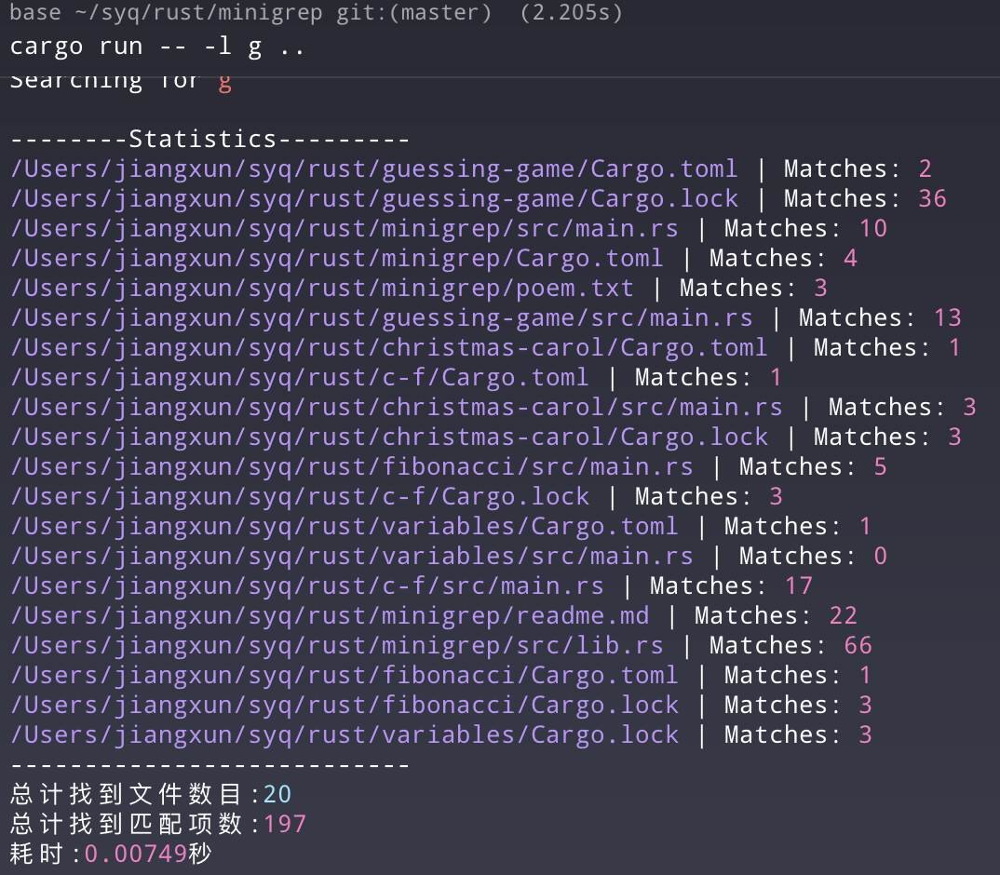

# Minigrep - Rust 高性能并行文件搜索工具


**Minigrep** 是一个使用 Rust 编写的高性能命令行文本搜索工具（类似 `grep` 或 `ripgrep` 的简化版）。它利用多线程并行处理、内存安全的并发机制以及优化的 I/O 策略，能够在海量文件中快速定位目标字符串。

## ✨ 功能特性 (Features)

*   **⚡ 极致性能**：
    *   **并行搜索**：利用 `ignore::WalkBuilder` 根据 CPU 核心数自动调度线程，并行遍历目录。
    *   **流式 I/O**：使用 `BufReader` 逐行读取，避免大文件一次性加载导致的内存溢出。
    *   **输出锁机制**：使用 `Arc<Mutex<stdout>>` 确保多线程环境下输出不乱序。
*   **🔍 智能搜索**：
    *   自动识别并忽略 `.gitignore` 中的文件及隐藏文件。
    *   支持忽略大小写搜索 (`-i`)。
    *   支持反向匹配（显示不匹配的行，`-v`，*待实现*）。
*   **🎨 友好体验**：v
    *   **彩色高亮**：自动高亮显示匹配到的关键字和行号。
    *   **详细统计**：搜索结束后展示耗时、匹配文件数及总匹配行数。
    *   **CLI 解析**：基于 `clap` 库构建的优雅命令行界面。

## 🚀 性能优化详解 (Optimizations)

本项目在原生 `minigrep` 基础上进行了深度优化：

1.  **并行迭代与所有权共享**：
    *   不再单线程处理文件路径。引入 `Arc` (Atomic Reference Counting) 将正则表达式 `Regex` 和配置对象在多个线程间安全共享，避免了昂贵的深度复制。
    *   利用 `ignore` 库的并行迭代器，自动平衡线程负载。

2.  **I/O 策略升级**：
    *   摒弃 `fs::read_to_string` 的全量加载模式，转而使用 `BufReader` 进行缓冲流式读取，大幅降低内存占用。

3.  **线程安全的输出缓冲**：
    *   为了防止多线程打印时控制台输出错乱（Race Condition），引入了输出锁。
    *   **批量输出策略**：在线程内部暂存单个文件的所有匹配结果，仅当该文件处理完毕后才获取全局锁进行一次性输出，最大程度减少锁竞争（Lock Contention）。

## 🛠️ 安装 (Installation)

确保你已安装 Rust 环境 (Cargo)。

```bash
git clone https://github.com/YourUsername/minigrep.git
cd minigrep
cargo build --release
```

可执行文件将位于 `./target/release/minigrep`。

## 📖 使用方法 (Usage)

```bash
# 基本用法：在当前目录搜索 "struct"
./minigrep "struct" ./

# 忽略大小写搜索
./minigrep "string" ./ -i

# 仅显示统计信息，不输出具体内容（适合大规模搜索预览）
./minigrep "TODO" ./ -l
```

### 命令行参数

| 参数 | 简写 | 描述 |
| :--- | :--- | :--- |
| `query` | | (必填) 需要查找的字符串或正则表达式 |
| `file_path` | | (必填) 搜索路径（文件或目录） |
| `--ignore-case` | `-i` | 忽略大小写 |
| `--stats-only` | `-l` | 仅显示统计结果 |

## 📊 运行截图


## 🤝 贡献 (Contributing)

欢迎提交 Issue 或 Pull Request！

1. Fork 本仓库
2. 新建 Feat_xxx 分支
3. 提交代码
4. 新建 Pull Request

## 📜 许可证

本项目遵循 MIT 许可证。

---